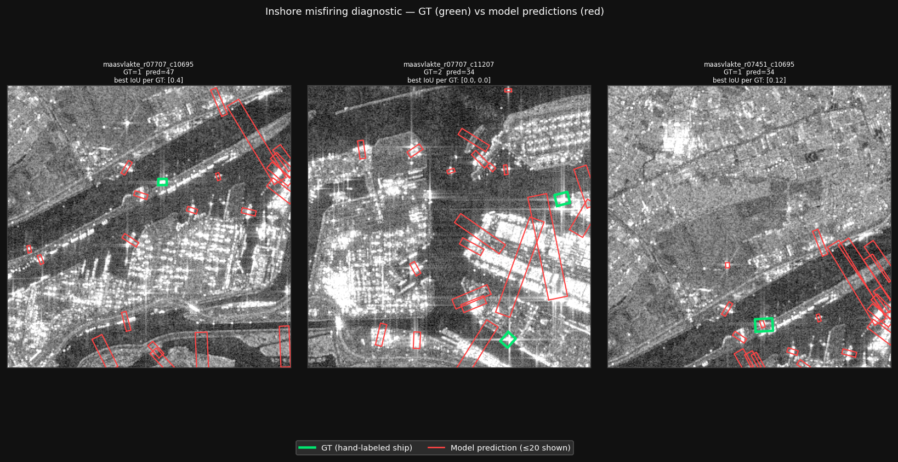

# Metrics — SAR Dark Ship Detection

Source of truth for all evaluation results. Each training run appends a row.
Numbers are from Ultralytics `.val()` at IoU threshold 0.5 unless noted.

---

## Baseline: v1_n (Week 1)

**Model:** `yolo11n-obb` (nano, ~2.7 M params)  
**Training data:** RSDD-SAR train split (5,000 images)  
**Eval data:** RSDD-SAR test split (2,000 images)  
**Weights:** [`tejassnaikk/rsdd-yolo11n-obb-v1`](https://huggingface.co/tejassnaikk/rsdd-yolo11n-obb-v1)

| Setting | mAP@0.5 | mAP@0.5:0.95 | Precision | Recall | N images |
|---------|---------|--------------|-----------|--------|----------|
| RSDD test (in-domain, overall) | **0.938** | 0.640 | 0.933 | 0.871 | 2,000 |
| RSDD test — inshore | 0.763 | 0.483 | 0.760 | 0.696 | 159 |
| RSDD test — offshore | 0.971 | 0.673 | 0.954 | 0.931 | 1,841 |

### Commentary

The overall mAP@0.5 of **0.938** is a strong in-domain result for a nano-scale model.
The more interesting story is in the inshore/offshore breakdown.

**The 21-point inshore/offshore gap (0.763 vs 0.971) is the central finding of Week 1.**

- **Offshore** (open ocean, isolated ships): near-optimal. mAP 0.971, recall 0.931.
  Ships in open water produce clean, high-contrast SAR signatures with minimal
  surrounding clutter. The model has learned this pattern reliably.

- **Inshore** (harbours, ports, coastal): substantially weaker. mAP 0.763, recall 0.696.
  Port environments present closely-spaced vessels (touching bounding boxes), high-backscatter
  infrastructure (quays, cranes, metal roofs), and ships partially occluded by structures.
  ~30% of inshore ships are missed entirely (recall 0.696 vs 0.931 offshore).

This gap is well-characterised and expected given the dataset's composition
(offshore images dominate: 1,841 vs 159). It is **not a bug** — it is the honest
performance envelope of the baseline model, and it sets up the Week 3 investigation:
when we apply this model to Sentinel-1 GRD (10 m resolution, which blurs small vessels
further), the inshore performance will almost certainly degrade more than the offshore.

Supporting plots: `reports/figures/baseline_v1/` (confusion matrix, P/R curve, loss curves).

---

## Week 2: Cross-Domain Evaluation — RSDD-SAR Model on Sentinel-1 GRD

### 1. Methodology

**Scenes**

| Scene | Acquisition | AOIs | Domain |
|-------|-------------|------|--------|
| Rotterdam S1A IW GRDH | 2025-04-30 05:58 UTC | maasvlakte (51.88–52.08°N, 3.88–4.25°E), ijmuiden (52.40–52.60°N, 4.38–4.72°E) | Inshore — port crops |
| Outer Thames Sector S1A IW GRDH | 2026-05-17 17:25 UTC | ots_aoi_a (53.30–53.80°N, 3.80–4.50°E), ots_aoi_b (53.50–54.05°N, 5.00–5.60°E) | Offshore — open water |

Both offshore AOIs are crops from a single acquisition, sharing the same incidence geometry, overpass time, and polarisation configuration. This is noted as a limitation (§6).

The Outer Thames scene was acquired under Beaufort 3 conditions (ERA5 multi-corner wind check). ots_aoi_b maintains a 24 km margin from the eastern boundary of the Gemini offshore wind farm (centre at ~5.90°E); pre-screening confirmed no turbine contamination in the labeling queue.

**Preprocessing**

Sigma-nought calibration applied via the SAFE calibration LUT (bilinear interpolation over the per-line `sigmaNought` vectors). DN → σ⁰ → 10 log₁₀(σ⁰) dB, then per-AOI 1st/99th percentile clip and linear stretch to uint8. No upsampling or resolution enhancement was applied; Week 2 explicitly measures the unadapted baseline gap at the native ~10 m/px Sentinel-1 GRD pixel spacing.

Chips: 512×512 px, stride 256 (50% overlap between adjacent chips), lossless PNG. Chips with >80% zero pixels (nodata boundary artefacts) were discarded before labeling.

---

### 2. Ground Truth

**Collection:** 1,063 chips, hand-labeled by a single annotator following
[`docs/labeling_protocol.md`](../docs/labeling_protocol.md). Labels use the RSDD-SAR
YOLO OBB format (one `.txt` per chip; empty file = confirmed negative;
missing file = unreviewed, excluded from evaluation).

**Final counts**

| AOI | Chips with ships | Confirmed empty | Total chips | Ship boxes |
|-----|-----------------|-----------------|-------------|------------|
| maasvlakte | 35 | 55 | 90 | — |
| ijmuiden | 24 | 57 | 81 | — |
| ots_aoi_a | 73 | 387 | 460 | — |
| ots_aoi_b | 43 | 389 | 432 | — |
| **Total** | **175** | **888** | **1,063** | **233** |

Chip-level counts refer to chips containing at least one OBB label. Total ship boxes (233)
exceeds labeled chips (175) because some chips contain multiple vessels.

**Audit methodology**

A structured re-review pass was applied to maasvlakte after initial labeling: all 31
initially-labeled chips were shown individually with their OBBs overlaid, and each was
either confirmed (`k`) or deleted (`d`). 29 were confirmed as water-surface vessels; 2
were deleted as land-target false positives (bright building returns misidentified during
tool familiarisation). Those 2 chips were returned to the unreviewed queue and subsequently
re-labeled correctly.

Spot-check passes were completed on all four AOIs: after the main and deferred passes, 20
random confirmed-empty chips per AOI were re-surfaced for second-look review. One chip in
ots_aoi_b was re-labeled as a ship during spot-check (ots_aoi_b_r06494_c15729: empty →
labeled).

Total known corrections: 3 out of 1,063 chips (~0.3%).

**Limitation:** `label_chips.py` overwrites the session JSON on each save, recording only
final state. Per-decision audit trail (intermediate flips, time spent per chip) was not
preserved. The correction rate should be read as a lower bound on labeling error.

---

### 3. Inference Setup

| Parameter | Value |
|-----------|-------|
| Model | `models_local/best.pt` — YOLOv11n-OBB |
| Training | 75 epochs on RSDD-SAR (5,000 train images), single class `ship` |
| Confidence threshold | 0.01 (intentionally low — retain full precision-recall curve) |
| NMS IoU threshold | 0.50 |
| Batch size | 32 |
| Device | Apple MPS |
| Total predictions | 1,513 |

Inference was run via `scripts/run_inference.py`, which calls `model.predict()` on each
chip and extracts normalized corner coordinates from `result.obb.xyxyxyxyn`. Both
predictions and ground truth were written to Parquet (one row per box) and evaluated with
`src/eval/obb_metrics.py` using Shapely polygon IoU.

---

### 4. Results

**Cross-domain mAP**

| Split | mAP@0.50 | mAP@0.25 | Predictions | GT boxes |
|-------|----------|----------|-------------|----------|
| inshore | 0.0006 | 0.0630 | 1,013 | 103 |
| offshore | 0.0051 | 0.2546 | 500 | 130 |
| **overall** | **0.0022** | **0.1370** | **1,513** | **233** |

**Comparison to Week 1 in-domain baseline (mAP@0.50)**

| Split | Week 1 (RSDD-SAR test, in-domain) | Week 2 (Sentinel-1 GRD, cross-domain) | Drop |
|-------|-----------------------------------|----------------------------------------|------|
| inshore | 0.763 | 0.0006 | −0.762 |
| offshore | 0.971 | 0.0051 | −0.966 |
| overall | 0.938 | 0.0022 | −0.936 |

The cross-domain drop is severe across both splits and both IoU thresholds. mAP@0.25
provides a less penalising view of localisation capability and is reported alongside
mAP@0.50 throughout, for reasons explained in §5.

---

### 5. Analysis — Two Distinct Failure Modes

The near-zero mAP@0.50 is not a single phenomenon. Diagnostic analysis identified two
mechanistically separate failure modes, one per split. Conflating them into a single
"domain gap" would misdiagnose both and lead to incorrect remediations.

#### 5.1 Offshore — Localisation works; box regression undersizes

**Evidence:**

- Median best-IoU per GT box (over all predictions on the same chip): **0.345**.
  The model is finding the right locations; the overlap is real but sub-threshold.
- At IoU@0.25: **52.8% of GT boxes are matched** (123/233). At the field-standard
  IoU@0.50: only 7.3% (17/233). The 45-point gap between these two recall figures
  is entirely attributable to box-size mismatch, not missed detections.
- Median prediction-to-GT area ratio: **0.640** (IQR 0.440–0.898). Predictions
  are systematically 64% of the ground-truth box area — a consistent, not random,
  undersizing.

**Labeling-convention hypothesis ruled out (Diagnostic 1):**

A sample of 343 RSDD-SAR ship instances (from 500 randomly drawn annotation files)
was analysed to determine whether RSDD uses tight point-scatterer labels (which would
make any hull-scale GT appear larger by design).

| Label set | Median area | Median long axis | Median short axis | Median h/w |
|-----------|-------------|------------------|-------------------|------------|
| RSDD-SAR training labels | 434 px² | 40.9 px | 11.1 px | 3.62 |
| Our GT — inshore | 302 px² | — | — | — |
| Our GT — offshore | 536 px² | — | — | — |

RSDD uses hull-scale labels, not point-scatterer labels. A 40.9 × 11.1 px box on
a 512×512 chip captures a recognisable elongated hull signature; a bright SAR core alone
would be 3–5 px across (~15–25 px²). The labeling convention is the same in both
RSDD and our GT. Our offshore GT boxes (536 px²) are in fact 1.24× *larger* than RSDD's
median, not smaller.

**Conclusion:** the 64% prediction-to-GT area ratio is genuine model under-regression,
not a label-style artefact. The box regression head has been calibrated on RSDD-SAR
signatures (ship-size distribution, incidence angles, sensor noise characteristics specific
to the RSDD scenes) and produces tighter boxes when applied to the Outer Thames
acquisition. Detection localisation is functionally intact; only the regression output
requires recalibration.

#### 5.2 Inshore — Training-data-coverage failure

**Evidence:**

- inshore mAP@0.25 = **0.063** — 28× lower than offshore (0.255), even at the lenient
  IoU threshold. This is not a box-size problem.
- 1,013 predictions fired on 171 inshore chips: **~5.9 predictions per chip** on average,
  against 103 GT boxes total. The 10:1 prediction-to-GT ratio indicates the model is
  systematically detecting non-ship targets at high rate.
- Median best-IoU per inshore GT box: **0.000** (more than half of GT ships have zero
  overlap with any prediction on the same chip). The model is not detecting the labeled
  ships; it is firing elsewhere.

**Visual confirmation (Diagnostic 2):**

Three maasvlakte chips with the highest per-chip prediction counts (47, 34, 34
predictions respectively) are shown with hand-labeled GT boxes (green) and model
predictions (red, capped at 20 per chip for readability). Predictions tile densely across
container terminal grids, crane structures, and quay return lines. GT-labeled vessels
(berthed in basins and approach channels) are in completely different chip locations; none
of the green GT boxes are covered by red predictions.

**Cause:** RSDD-SAR is an exclusively open-water dataset. No port infrastructure, container
yards, or quay structures appear in RSDD training images. The model has acquired no learned
signal to suppress bright stationary port targets. Rotterdam's Maasvlakte terminal and the
North Sea Canal approaches at IJmuiden are SAR-bright (metallic infrastructure, corner
reflectors from cranes and stacked containers) and morphologically similar to the high-σ⁰
clusters the model learned to flag as ships. The port environment is out-of-distribution
not in the sense of sensor noise or resolution, but in the sense of background clutter class
composition.

---

### 6. Limitations

1. **Single annotator.** All 1,063 chips were labeled by one person. Inter-annotator
   agreement was not measured. The ~0.3% known correction rate is a lower bound; unaudited
   corner cases (borderline berthed ships, small offshore blobs) are unquantified.

2. **Audit trail not preserved.** `label_chips.py` records only the final chip state
   in the session JSON. Per-decision history (how many times a chip was deferred, whether
   it was initially labeled differently) is not available. The structured re-review pass
   on maasvlakte is the only session with a formal audit record.

3. **Single offshore acquisition.** Both ots_aoi_a and ots_aoi_b are crops from the same
   Outer Thames overpass (2026-05-17, Beaufort 3, ascending pass). Scene-to-scene
   variability in wind state, sea state, and incidence geometry is not sampled. The
   offshore mAP numbers characterise one acquisition, not the offshore domain.

4. **Two crops, one swath.** The two offshore AOIs share incidence angle, overpass time,
   and sensor configuration. They provide spatial diversity within one swath but not
   across the distribution of viewing conditions the model will encounter operationally.

5. **Small GT sample for offshore mAP.** 130 offshore GT boxes. At this N, a handful of
   annotation decisions (one missed cluster of ships, one incorrectly included blob) can
   shift mAP by several points. Results should be read as indicative, not precise.

6. **Wind-farm proximity.** ots_aoi_b is 24 km from the Gemini wind farm eastern boundary.
   Pre-labeling density screening found no turbine signatures in the chip queue, but faint
   azimuth-ambiguity sidelobe leakage from turbines at that separation cannot be fully
   ruled out.

7. **mAP@0.50 conflates two failure modes.** For predictions that correctly localise a
   target but undersize the box (the offshore case), mAP@0.50 reports near-zero regardless
   of detection quality. mAP@0.25 is not a softer alternative — it is the appropriate
   metric for separating localisation capability from regression calibration. Both
   thresholds are reported throughout.

---

### 7. Implications for Week 3

The two failure modes require two separate remediations. A single fine-tuning run on
mixed inshore/offshore data would address neither cleanly.

**Offshore — recalibrate box regression, preserve detector**

Detection localisation is intact (median best-IoU 0.345, ~53% recall at IoU@0.25). The
regression head needs to be recalibrated to output hull-scale boxes for ~10 m/px Sentinel-1
GRD imagery. A small labeled Sentinel-1 fine-tuning set (50–100 chips with careful OBB
labels from the existing labeled inventory, or a new acquisition) should be sufficient to
shift the regression output without destabilising the detection head. The detector itself
does not need retraining.

**Inshore — add port-infrastructure negative examples to training**

The inshore false-positive flood originates from a training-set coverage gap, not a model
capacity limit. RSDD-SAR contains no port-infrastructure examples; the model has learned
no suppression signal for cranes, container yards, or quay structures. Adding hard negative
mining — chips of port infrastructure with confirmed-empty labels — directly addresses this.
The labeled maasvlakte and ijmuiden empty chips (55 + 57 = 112 confirmed-empty port chips)
already constitute a usable negative set. These should be incorporated into the next
fine-tuning round explicitly, balanced against positive port-ship examples.

These are independent fixes. Running both simultaneously in a combined fine-tuning job is
possible but makes it harder to isolate which change produces which improvement. The
recommended Week 3 sequence is to run them as separate ablation experiments.

---

*Report generated: 2026-06-04. Evaluation scripts: `scripts/run_inference.py`,
`src/eval/obb_metrics.py`. Raw outputs: `reports/predictions.parquet`,
`reports/ground_truth.parquet`. Labeling pipeline: `scripts/label_chips.py`,
`scripts/screen_chips.py`, `src/data/label_io.py`.*
